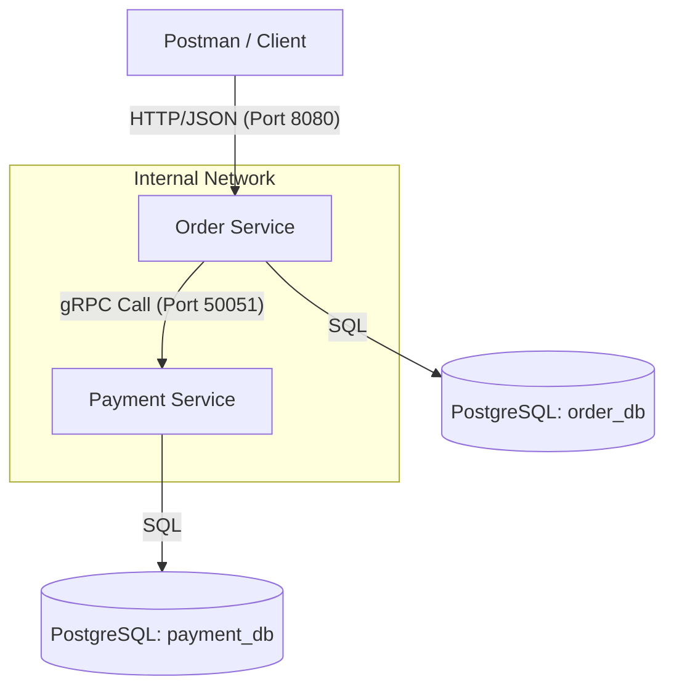

```mermaid
graph TD
    Client[Postman / Client] -- HTTP/JSON (Port 8080) --> OrderService[Order Service]
    
    subgraph "Internal Network"
        OrderService -- gRPC Call (Port 50051) --> PaymentService[Payment Service]
    end

    OrderService -- SQL --> OrderDB[(PostgreSQL: order_db)]
    PaymentService -- SQL --> PaymentDB[(PostgreSQL: payment_db)]
```
