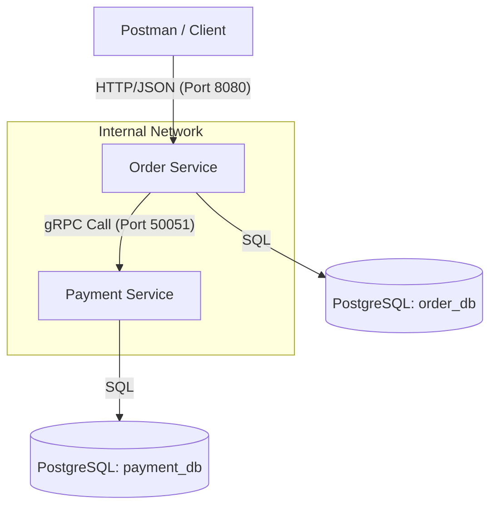

Project Structure & Repository Links
The project is split into three separate repositories to follow microservices best practices:

: Contains the logic for Order and Payment services, and the Docker infrastructure.

: The "Source of Truth" for all gRPC definitions.

: Contains the pre-compiled Go code (stubs) generated from the protos, imported by both services as a Go module.

