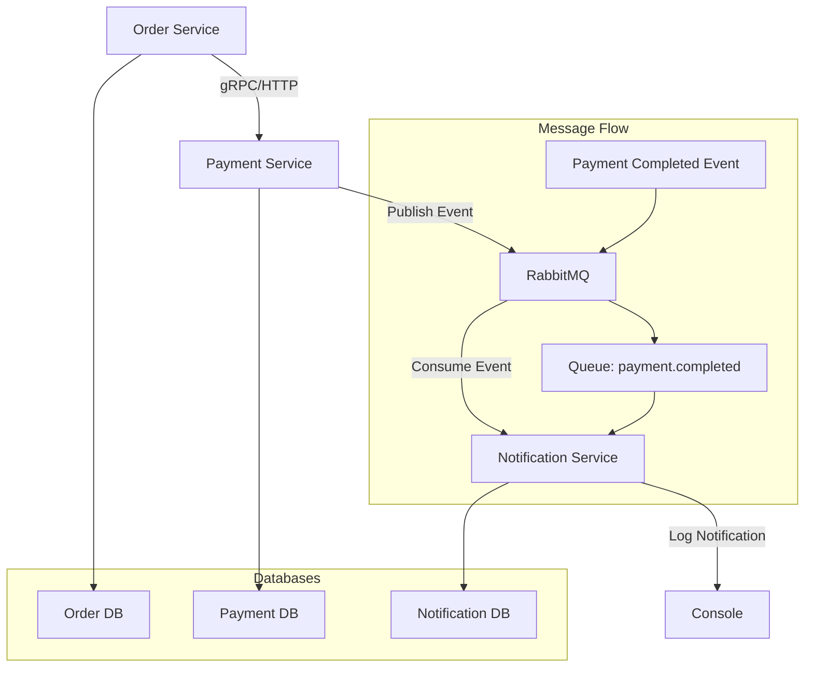

```mermaid
graph TD
    A[Order Service] -->|gRPC/HTTP| B[Payment Service]
    B -->|Publish Event| C[RabbitMQ]
    C -->|Consume Event| D[Notification Service]
    D -->|Log Notification| E[Console]

    subgraph Databases
        F[Order DB]
        G[Payment DB]
        H[Notification DB]
    end

    A --> F
    B --> G
    D --> H

    subgraph Message Flow
        I[Payment Completed Event] --> C
        C --> J[Queue: payment.completed]
        J --> D
    end
```